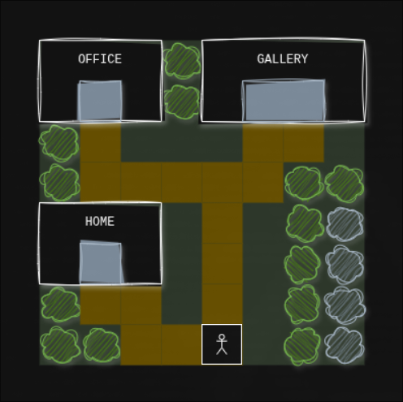

# portfolio

A portfolio.

View [portfolio](https://jimj92120.github.io/portfolio/).



---

# setup

|        |        |
| ------ | ------ |
| `node` | `>=20` |
| `npm`  | `>=10` |

### install

```sh
# clone repository
git clone <repository-name>

# install dependencies
npm install
```

---

# commands

```sh
# start development server
npm run start

# build
npm run build
```

---

---

#
